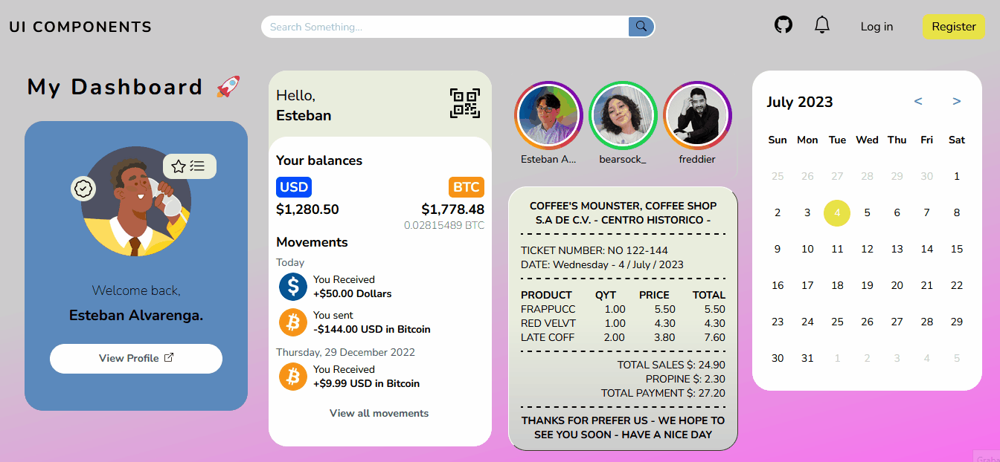

# Pagina de Componentes 💻✅🚀

Una página web estática muy común y corriente en cuanto a funcionabiliad, incluso más artistica que dinámica. Pero que contiene diferentes estilos de componentes o interfaces que pueden ser usados en distintios sitios web ⚛️.

[**Ir a la página de Componentes de Diseño**](https://alvarenga144.github.io/UI-Components-Interfaces/) Entre estos componentes hay:

- Barra de navegación 💻
- Barra para búsqueda 🔍
- Botones de links hacia otros sitios ➡️
- Tarjeta de presentación 🫡
- Interfaz de Wallet de Bitcoin y Dolar 💲💰
- Carrusel de Historias de instagram 📷
- Barra de navegación en móbil 📲
- Formato de ticket físico 🎫
- Calendario dinámico 🗓️

**Creada con los básicos de desarrollo web, HTML, CSS Y JavaScript. es una web sensilla, pero que intenta demostrar el uso de la maquetación, CSS Vanilla, Grid, degradados, overs y un poco de JavaScript básico.**

# English

A very common and ordinary static web page in terms of functionality, even more artistic than dynamic. But it contains different styles of components or interfaces that can be used on various websites ⚛️. [**Go to Componentes UI Web**](https://alvarenga144.github.io/UI-Components-Interfaces/) Among these components are:

- Navigation bar 💻
- Search bar 🔍
- Buttons linking to other sites ➡️
- Business card 🫡
- Bitcoin and Dollar Wallet interface 💲💰
- Instagram Stories carousel 📷
- Mobile navigation bar 📲
- Physical ticket format 🎫
- Dynamic calendar 🗓️

**Created with the basics of web development, HTML, CSS, and JavaScript. It is a simple website, but it aims to demonstrate the use of layout, Vanilla CSS, Grid, gradients, overlays, and some basic JavaScript.**
